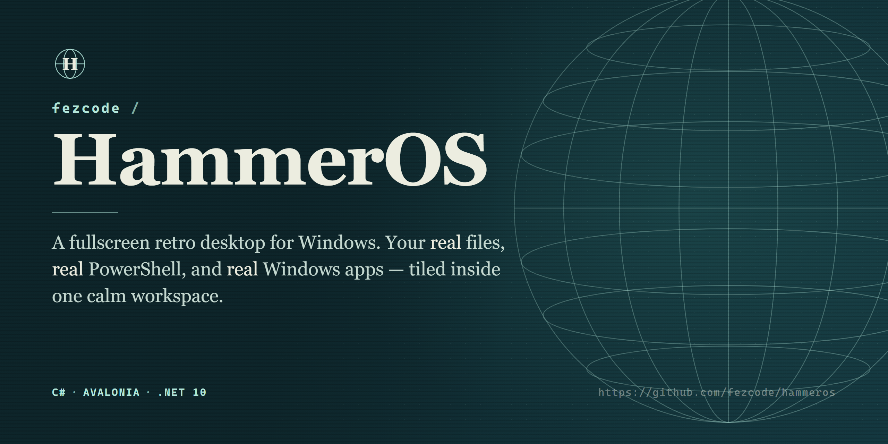
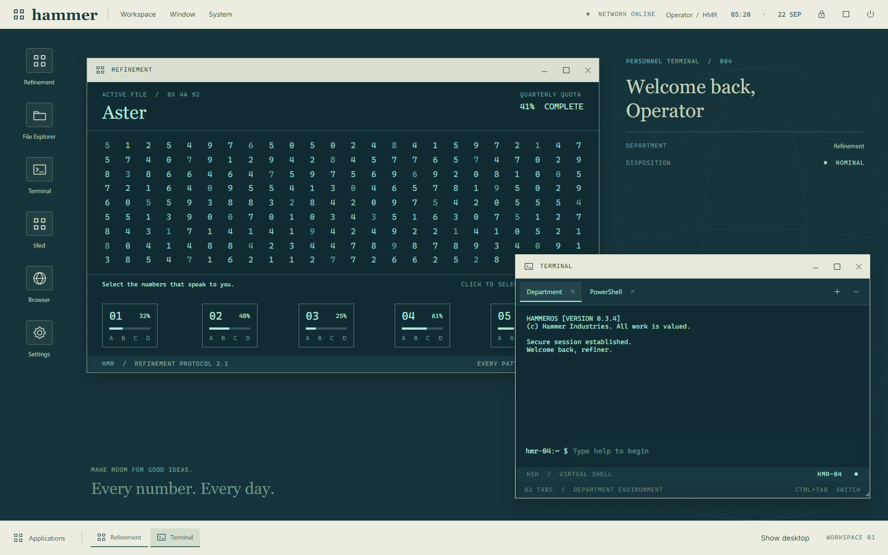
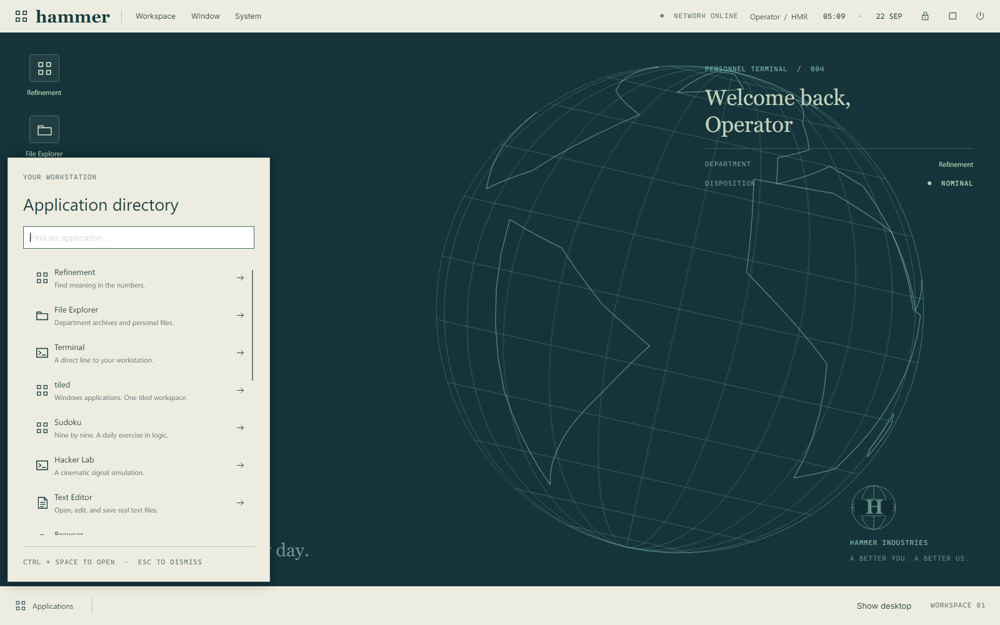
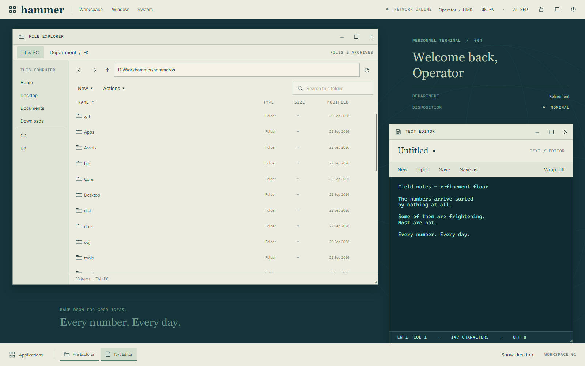
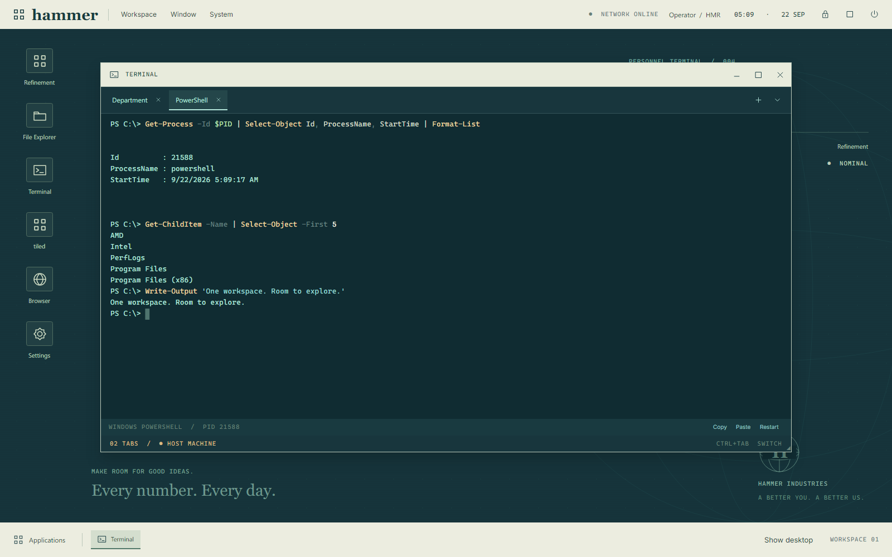
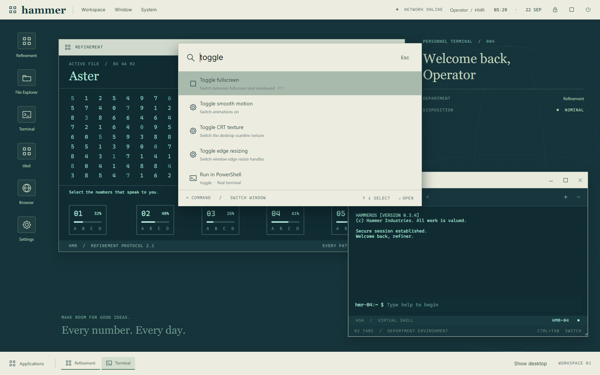
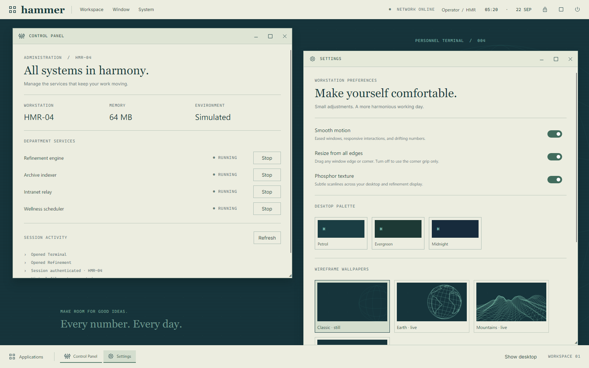
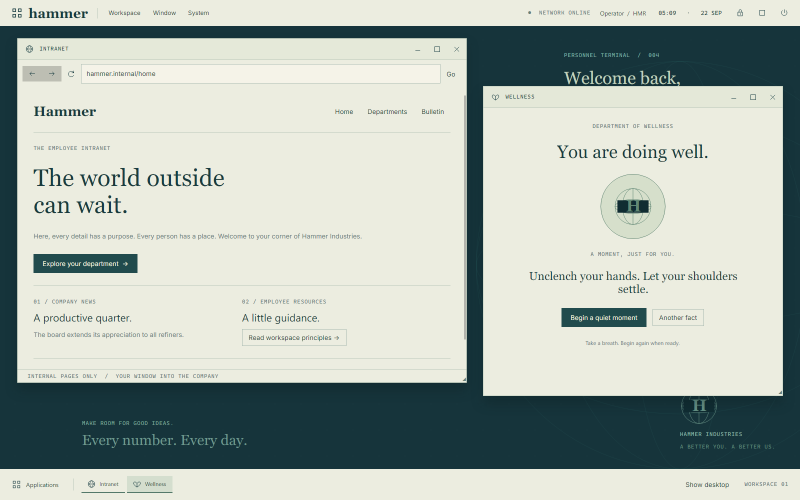
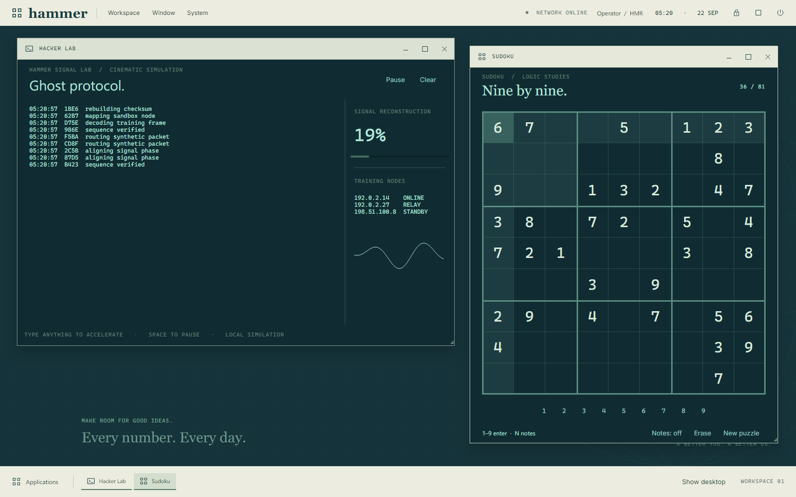
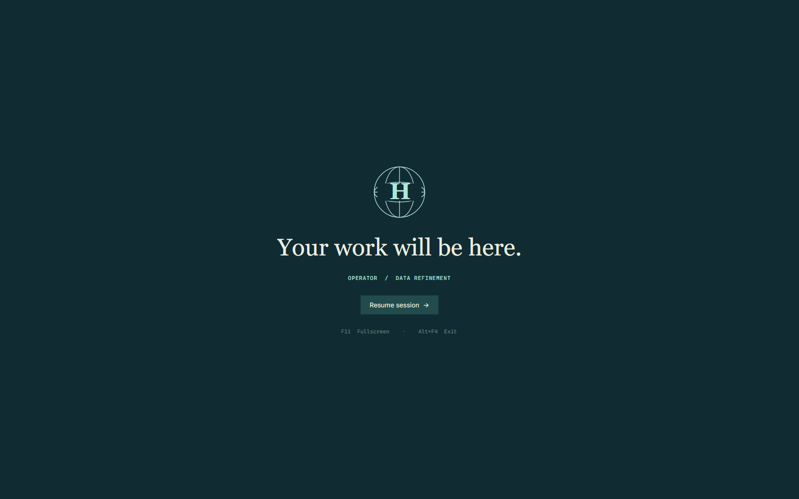

<div align="center">

**A fullscreen retro workspace for Windows, built as a native C# / Avalonia desktop app.**


</div>

---

Cream institutional chrome, petrol-blue surfaces, phosphor typography, animated data, and an unreasonably reassuring employee intranet.

Underneath the fiction, the workspace is real. HammerOS opens your actual drives and files, runs unelevated PowerShell and CMD sessions through Windows ConPTY, and reparents real Windows applications into a tiled layout — alongside the playful Department environment it is dressed in.



## Install

Run `dist/installer/HammerOS-Setup-<version>.exe`, or open `dist/HammerOS/HammerOS.exe` directly. The published Windows x64 build includes the .NET runtime. Browser and Media Player use the Microsoft Edge WebView2 Runtime already installed on Windows.

From source, with the .NET 10 SDK:

```powershell
dotnet run --project HammerOS.csproj
dotnet run --project HammerOS.csproj -- --windowed
```

`F11` switches between fullscreen and windowed modes, and `Alt+F4` exits. `--help` and `--version` are also supported; use `dotnet HammerOS.dll --help` for console output from the development build.

## Inside the desktop

| Application | What it does |
| --- | --- |
| Refinement | Select number clusters and assign them to five bins. Progress persists. Supports pointer and keyboard selection. |
| Sudoku | A separate 9×9 puzzle with a unique solution, pencil notes, conflict highlighting, and saved progress. Refinement remains its own app. |
| Hacker Lab | A cinematic local simulation with scrolling telemetry, a signal plot, pause/resume, and typing effects. |
| Text Editor | Open and save real UTF-8 documents, wrap text, inspect line and column position, and confirm unsaved changes before closing. |
| Browser | Browse real HTTP/HTTPS pages with an embedded WebView2 engine, navigation history, and address/search input. |
| Media Player | Play local audio and video inside HammerOS, with play/pause, seeking, mute, and volume. Codec support follows WebView2. |
| Calendar | A custom month grid and local agenda, with persisted events and a matching clock popup. |
| Terminal | Independent PowerShell, CMD, and Department tabs; add, rename, reorder, switch, and close sessions. |
| File Explorer | Real drives and files in This PC, plus the virtual Department drive. Create, rename, copy, move, recycle, edit UTF-8 text, and open files in Windows apps. |
| tiled | Launch or attach supported Windows application windows in grid, columns, rows, or focus layouts. Detach restores their desktop positions. |
| Intranet | Browse company pages with address navigation, back/forward history, and simulated connection state. |
| Memoranda | Edit and save `/personal/notes.txt`, shared with the virtual filesystem. |
| Settings | Change palette, motion, colliding windows, CRT texture, employee designation, and fullscreen mode. |
| Control Panel | Start and stop simulated services and inspect session activity. |
| Network | Inspect actual Windows adapters and open Windows network settings; Department diagnostics remain simulated. |
| Wellness | A guided, animated one-minute breathing session and company-approved facts. |
| Employee Handbook | Learn the controls and the rules of this environment. |

Windows can be dragged, resized, minimized, restored, maximized, tiled, and cascaded. The top bar carries Workspace, Window, and System menus, network status, profile settings, and a calendar. System links open Windows Settings, Task Manager, and Explorer. A searchable launcher, taskbar, desktop toggle, session lock, and shutdown panel complete the shell.

Every application supports multiple windows. Launch again from the desktop or Applications directory; numbered titles, taskbar tooltips, and the Window menu distinguish each instance. Resize windows from any edge or corner; **Settings → Resize from all edges** can disable edge handles while retaining the corner grip.

Right-click an app on the bottom bar for restore, minimize, maximize, a new instance, or close. Closing retains the normal unsaved-document and tiled confirmation prompts. Right-click empty bar space for search, applications, desktop, window layouts, and settings.



**Settings → Wireframe wallpapers** offers the still Classic backdrop, a rotating Earth, drifting mountain terrain, rolling Waves, and a spinning Torus. The palette also tints window title bars, the taskbar, buttons and the dark screens of Refinement, terminals, the editor and Sudoku. Wallpaper and palette choices persist. **Animate live wallpaper** pauses the scene independently; turning off Smooth motion also pauses it. Animation stops while HammerOS is locked or minimized.

## Real files



**File Explorer → This PC** opens your actual user directory. Use the sidebar or address bar to browse local drives, and the list refreshes when files change. The Actions and right-click menus provide opening, renaming, copying, cutting, pasting, recycling, text editing, and **Terminal here**. Copy and cut use a HammerOS-local file clipboard. Transfers refuse to overwrite existing items; recursive copies refuse junctions and symbolic links. Recycle requires confirmation.

Click Name, Type, Size, or Modified to sort, and click again to reverse direction. Folders remain grouped first. The Department drive also has sortable headers, and the file clipboard works across Explorer windows.

Opening supported audio or video files launches HammerOS Media Player. Text documents open directly in Text Editor, including `.txt`, `.txtt`, Markdown, source and configuration files, and detected UTF-8 text with unfamiliar extensions. File paths pasted into Explorer's address bar also open files. **Open in Text Editor** explicitly chooses the editor; **Open with Windows** uses the Windows file association. Drag real files between Explorer windows or onto folder rows to copy them; Windows Explorer files can also be dropped into HammerOS. Drops never overwrite existing names. Drop one text document onto Text Editor, or media onto Media Player's toolbar. Dropping onto an open Editor, Media Player, or Explorer taskbar button opens the file or copies it into that Explorer folder. Unsaved editor changes are confirmed before replacement.

Choose **Edit here (inline editor)** in Explorer's context or Actions menu to edit inside the file window, for UTF-8 files up to 2 MB. **Open in Text Editor** uses the separate editor, which handles up to 8 MB and includes Open, Save, Save As, New, wrap, and unsaved-change prompts. Both preserve the UTF-8 BOM and detect on-disk modification before saving. Save explicitly before leaving the inline editor. Other formats open in their default Windows application. **Department / H:** retains the separate virtual records and fun content.

## Real PowerShell



Open **Terminal → PowerShell**. HammerOS launches an unelevated shell using Windows ConPTY, preferring PowerShell 7 when installed and falling back to Windows PowerShell. Sessions start in your user directory without loading a profile, or in the directory chosen by File Explorer's Terminal here. Use + for another PowerShell, or the dropdown for CMD, Department, and a list of all tabs. Right-click a tab to rename, move left, or close it. Each host tab has its own process and continues running in the background. You can load your PowerShell profile explicitly in the shell if desired.

The terminal supports ANSI colors, Unicode, alternate screens, resize, shell history, completion, selection, copy and paste, and 5,000 lines of scrollback. The VT engine comes from the local Clockt project; its provenance is recorded in [vendor/README.md](vendor/README.md).

Real PowerShell and CMD commands affect your real machine. The **HOST MACHINE** indicator identifies these tabs. Closing a tab terminates its shell and owned child processes, without affecting other tabs. Closing Terminal or exiting HammerOS ends all its sessions; minimizing preserves them. This differs from tiled's borrowed windows, which are detached on exit. Terminal mouse reporting and clickable OSC hyperlinks are not currently exposed by the renderer.

## Windows apps in tiled

Open **tiled → Launch app**, enter an executable and optional arguments, or use **Attach window** to select an existing window. Windows desktop applications are reparented into native containers, retaining their real interface and input. Drag a tile title onto another tile to change its position, and drag the dividers to resize rows and columns. **Focus** hides the workspace toolbar and individual title strips, showing one native window with named application tabs across the top. **Exit focus** restores the layout controls.

The ↗ button restores an application's original position and window styles. The × button detaches and asks the app to close normally, allowing its own save prompt. Closing a populated tiled workspace asks for confirmation before detaching its apps, and exiting HammerOS also asks while native windows are attached. Apps keep running after detachment. Native app surfaces hide while another HammerOS window or overlay is active.

Embedding depends on the application's compatibility with Windows `SetParent`. Some elevated, packaged, multi-window, or custom-rendered apps need to run separately. Apps that launch into another process can be chosen with Attach window after launch. Attached apps own their keyboard focus; click the HammerOS title bar to use workspace shortcuts. HammerOS is a desktop workspace, not a replacement for Windows or a security boundary.

## Hammer Search



**Alt+Space** opens Hammer Search while HammerOS has keyboard focus. Type an app name to open it, `switch editor` to focus an existing window, or `toggle fullscreen`, `toggle smooth motion`, `toggle CRT texture`, `toggle edge resizing`, or `toggle colliding windows` for quick settings. Use the arrow keys and Enter; Escape or a click outside dismisses the palette. Search also includes available Windows Start menu shortcuts, which open outside HammerOS. Prefix a command with `>` or `run ` to execute it in a new real PowerShell tab; its output stays visible and the shell remains interactive. The Workspace menu also provides Search when a native embedded app owns keyboard focus.

### Keyboard

| Shortcut | Action |
| --- | --- |
| Alt+Space | Apps, windows, commands, and quick actions |
| Ctrl+Space | Application directory |
| Ctrl+L | Lock HammerOS outside text input; clear PowerShell; focus the address bar in File Explorer |
| Ctrl+Shift+T / Ctrl+Shift+W | New PowerShell / close active terminal tab |
| Ctrl+Tab / Ctrl+Shift+Tab | Next / previous terminal tab |
| F2 / Delete in file list | Rename / request recycling |
| Ctrl+C / Ctrl+X / Ctrl+V in file list | Copy / cut / paste files within HammerOS |
| F5 / Alt+Left / Alt+Right in File Explorer | Refresh / back / forward |
| F11 | Toggle fullscreen |
| Alt+F4 | Close the focused Windows application |
| Ctrl+C in PowerShell | Interrupt the running command |
| Ctrl+Shift+C in PowerShell | Copy selected text, or the screen if no selection |
| Ctrl+Shift+V / Shift+Insert | Paste into PowerShell |
| Mouse wheel in PowerShell | Scroll terminal history |

## Settings and persistence



Motion includes eased window transitions, focus colors, hover feedback, page and tab changes, drifting numbers, collection effects, and guided breathing. Turn off **Smooth motion** in Settings to reduce movement. HammerOS uses the same cream context menus in Explorer, text fields, terminal tabs and surfaces, the taskbar, Browser, and Media Player; text menus include undo and redo, cut, copy and paste, delete, and select all. Windows apps embedded in tiled retain their own native interface.

Virtual files, preferences, refinement and Sudoku progress, and local calendar events are written atomically to `%LOCALAPPDATA%/HammerOS/session.json`. WebView2 keeps its profile in `%LOCALAPPDATA%/HammerOS/WebView2`. Real terminal sessions are not persisted, and service switches reset when the app starts. Memoranda and the record editor save when you press their Save button. Stock virtual documents from the previous branding are migrated only when they still match their original contents.

## The Department



The Department shell and drive, intranet pages, Department service switches, refinement, Hacker Lab, and session lock remain simulated. The **Intranet** app renders built-in pages; the separate **Browser** app renders real websites.





## Build and verify

```powershell
./version.ps1                 # report the release version and check it agrees everywhere
./build.ps1                   # build, run every check, publish dist/HammerOS, self-test it
./installer.ps1 -SkipBuild    # package dist/installer/HammerOS-Setup-<version>.exe with Forge
```

`build.ps1` runs the whole verification set below; the individual pieces are:

```powershell
dotnet build HammerOS.csproj
dotnet run --project tools/Checks
dotnet run --project tools/HostChecks
dotnet run --project tools/TiledChecks
dotnet run --project tools/WebChecks
dotnet run --project tools/Preview -- dist/preview
dotnet run --project tools/Preview -- dist/preview-host --host
dotnet run --project tools/Preview -- dist/chrome --chrome
dotnet publish HammerOS.csproj -c Release -r win-x64 --self-contained true -p:PublishSingleFile=true -p:IncludeNativeLibrariesForSelfExtract=true -o dist/HammerOS
dist/HammerOS/HammerOS.exe --selftest
```

The UI checks exercise actual Avalonia controls, pointer resizing, multiple windows, file sorting, real documents, launcher dismissal, Sudoku, and calendar persistence. HostChecks verifies real PowerShell and CMD sessions. TiledChecks creates temporary Windows applications and verifies embedding, resizing, reordering, focus tabs, close confirmation, and safe detachment. WebChecks uses a local HTTP server and a silent WAV fixture to verify the actual browser engine and media controls. Preview renders use the production UI; `--chrome` includes real popups and hover states, and `--host` checks terminal input. TiledChecks and WebChecks open real windows for a few seconds. `--selftest` starts the platform and seeds a throwaway workspace without opening a window, which is how the published single-file binary is verified.

Release and installer conventions are recorded in [AGENTS.md](AGENTS.md).

## Structure

| Path | Contents |
| --- | --- |
| `Desktop/` | Desktop composition, window management, motion, and vector artwork. |
| `Apps/` | Seventeen applications, terminal tab manager, real file explorer, WebView2 surface, and native window hosting. |
| `Core/` | Real and virtual filesystems, saved state, native Windows attachment, Department shell, and ConPTY lifecycle. |
| `vendor/Clockt.Terminal/` | Standalone terminal parser and screen model. |
| `tools/` | Reproducible checks and native visual previews. |

ConPTY integration follows Microsoft's [pseudoconsole lifecycle](https://learn.microsoft.com/en-us/windows/console/creating-a-pseudoconsole-session) and [job object](https://learn.microsoft.com/en-us/windows/win32/procthread/job-objects) documentation.

## License

[MIT](LICENSE.txt) — Copyright (c) 2026 Samil Bulbul.
