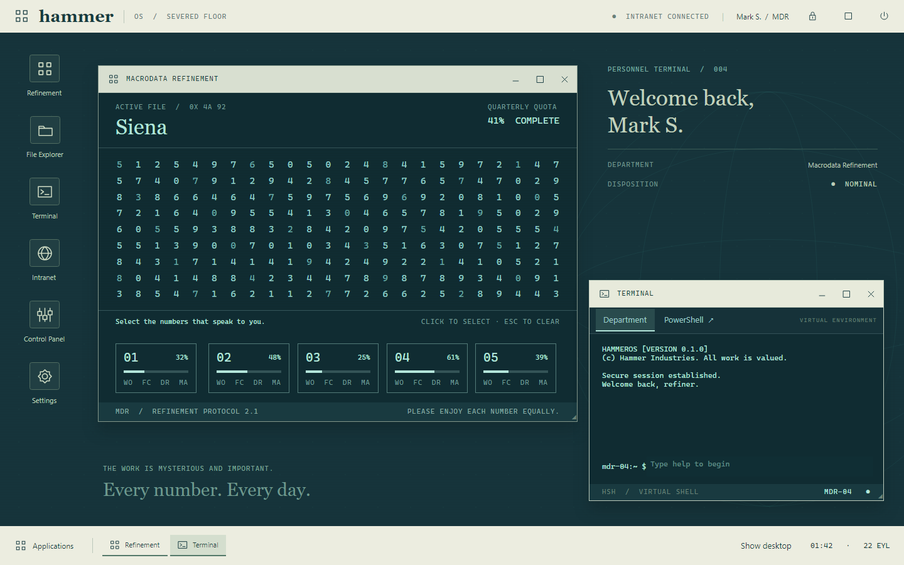

# HammerOS

A fullscreen, fictional operating environment inspired by Lumon Industries and *Severance*. Built as a native C# / Avalonia desktop app, following the approach used by Cogas and Clockt.



Cream institutional chrome, petrol-blue surfaces, phosphor typography, animated macrodata, and an unreasonably reassuring employee intranet. Applications share a virtual system, and a real PowerShell terminal is available when you want to work on your actual computer.

## Run

Open `dist/HammerOS/HammerOS.exe`. The published Windows x64 build is self-contained; keep the executable wherever you prefer.

From source, with the .NET 10 SDK:

```powershell
dotnet run --project HammerOS.csproj
dotnet run --project HammerOS.csproj -- --windowed
```

`F11` switches between fullscreen and windowed modes. `Alt+F4` exits. `--help` and `--version` are also supported; use `dotnet HammerOS.dll --help` for console output from the development build.

## Inside the desktop

| Application | What it does |
| --- | --- |
| Macrodata Refinement | Select number clusters and assign them to five bins. Progress persists. Supports pointer and keyboard selection. |
| Terminal | Switch between the virtual Department shell and real Windows PowerShell. |
| File Explorer | Navigate, filter, create folders and records, edit text, and delete records in the virtual drive. |
| Intranet | Browse company pages with address navigation, back/forward history, and simulated connection state. |
| Memoranda | Edit and save `/personal/notes.txt`, shared with the virtual filesystem. |
| Settings | Change palette, motion, CRT texture, employee designation, and fullscreen mode. |
| Control Panel | Start/stop simulated services and inspect session activity. |
| Network | Toggle the fictional intranet adapter and run simulated diagnostics. |
| Wellness | A guided, animated one-minute breathing session and company-approved facts. |
| Employee Handbook | Learn the controls and the rules of this environment. |

Windows can be dragged, resized, minimized, restored, and maximized. A searchable launcher, taskbar, desktop toggle, session lock, and shutdown panel complete the shell. Motion includes eased window transitions, focus colors, hover feedback, page changes, drifting numbers, collection effects, and guided breathing. Turn off **Smooth motion** in Settings to reduce movement.

## Real PowerShell

Open **Terminal → PowerShell**. HammerOS launches an unelevated shell using Windows ConPTY, preferring PowerShell 7 when installed and falling back to Windows PowerShell. Sessions start in your user directory without loading a profile. You can load your profile explicitly in the shell if desired.

The terminal supports ANSI colors, Unicode, alternate screens, resize, shell history, completion, selection, copy/paste, and 5,000 lines of scrollback. The VT engine comes from the local Clockt project; its provenance is recorded in [vendor/README.md](vendor/README.md).

| Shortcut | Action |
| --- | --- |
| Ctrl+Space | Search applications |
| Ctrl+L | Lock HammerOS; in real PowerShell, clear the terminal |
| F11 | Toggle fullscreen |
| Alt+F4 | Exit HammerOS |
| Ctrl+C in PowerShell | Interrupt the running command |
| Ctrl+Shift+C in PowerShell | Copy selected text, or the screen if no selection |
| Ctrl+Shift+V / Shift+Insert | Paste into PowerShell |
| Mouse wheel in PowerShell | Scroll terminal history |

Real PowerShell commands affect your real machine. The **HOST MACHINE** indicator identifies this mode. Closing its application window or exiting HammerOS terminates the shell and its owned child processes; minimizing it preserves the session. Terminal mouse reporting and clickable OSC hyperlinks are not currently exposed by the renderer.

The Department shell, File Explorer, Network, Intranet, services, and session lock are simulated. They do not replace Windows, alter its networking, or provide an operating-system security boundary. The intranet browser renders built-in pages rather than external websites.

## Persistence

Virtual files, preferences, and refinement progress are written atomically to `%LOCALAPPDATA%/HammerOS/session.json`. Real terminal sessions are not persisted. Service switches reset when the app starts. Memoranda and the record editor save when you press their Save button.

## Build and verify

```powershell
dotnet build HammerOS.csproj
dotnet run --project tools/Checks
dotnet run --project tools/HostChecks
dotnet run --project tools/Preview -- dist/preview
dotnet run --project tools/Preview -- dist/preview-host --host
dotnet publish HammerOS.csproj -c Release -r win-x64 --self-contained true -p:PublishSingleFile=true -p:IncludeNativeLibrariesForSelfExtract=true -o dist/HammerOS
```

The UI checks exercise actual Avalonia controls and pointer input. Host checks start temporary PowerShell sessions, verify real commands, resizing, Unicode, interruption, and cleanup of an owned child process. Preview renders use the production UI; `--host` additionally verifies typing into the real terminal and closes the test session afterward.

## Structure

- `Desktop/`: desktop composition, window management, motion, and vector artwork.
- `Apps/`: the ten applications and native terminal surface.
- `Core/`: virtual filesystem, saved state, Department shell, and real ConPTY lifecycle.
- `vendor/Clockt.Terminal/`: standalone terminal parser and screen model.
- `tools/`: reproducible checks and native visual previews.

An independent fan project, unaffiliated with Apple or *Severance*. ConPTY integration follows Microsoft's [pseudoconsole lifecycle](https://learn.microsoft.com/en-us/windows/console/creating-a-pseudoconsole-session) and [job object](https://learn.microsoft.com/en-us/windows/win32/procthread/job-objects) documentation.
